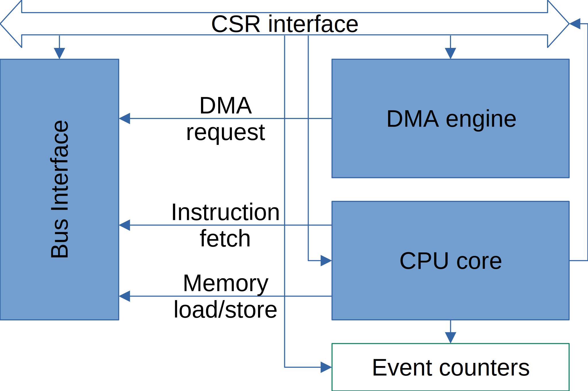

Introduction
============

Espresso is the main processor of the Anachronistic Computer (Anachron). It is a simple, low-end implementation of the `Brew <https://github.com/andrastantos/brew>`_ processor architecture.

Espresso is a bit more than just a Brew implementation however. It contains a memory controller, a refresh generator and a DMA controller as well.

Just like the Anachron project as a whole, the Espresso processor is aimed as an imaginary design from the early '80s. It has to adhere to the technological limitations of the age, and be a 'good citizen' in the ecosystem of the era.

I imagine Espresso to be manufactured in 1.5um (N)MOS technology and to have a target clock rate of about 8-10MHz. It is intended to be a contemporary of the Intel 80286 and the Motorola 68010 processors, while being smaller (in die area) and faster. Espresso fits in a 40-pin DIP package, running from a single 5V power supply and a simple 50% duty-cycle clock source.

Putting all these features together, Espresso should have been a cheaper, higher-performance option for the time.

The high-level block diagram of the design is the following:

.. admonition:: Why?

    So, why Brew for this project? Mostly because ... why not? It's a riff on a variable-instruction-length RISC architecture, which straddles the RISC vs. CISC divide that started to emerge around that time in CPU architecture. It fits right in. It's also a 32-bit ISA with a 16-bit instruction encoding, something that would have been rather valuable in those memory-constrained days.

    One of the biggest, if not *the* biggest obstacle for improving performance of processors is memory speed. The traditional answer to this problem is the introduction of ever deeper levels of cache hierarchy. For our design target, however caches are not really possible: they are too big to have them on die and require too many pins to have them off.

    What's left? Getting the memory interface as fast as possible. The technology landscape, being what it was, forces us to use page-mode (not even fast-page-mode) DRAM memories with access times of 100ns or so.

    I decided the best way to maximize memory bandwidth is to directly interface to DRAM and generate page-mode bursts wherever possible. The consequence of that decision is that the memory controller (including refresh generation) became part of the processor.

    The benefit is highly reduced pin-count; not only I was able to (forced, really) to multiplex the address-bus, I had the opportunity to address two banks of memory in alternating halves of the clock-cycle: effectively implementing DDR access.

    To further improve efficiency (on the system level), spending as little time on bus arbitration as possible is also important. We need some way of accepting request from and granting bus-accesses to external peripherals anyway (chiefly the display controller). Integrating a DMA controller is not that big a leap from there. Such integration is beneficial as we save a lot on package cost (no need for yet another package) and add relatively small amount of silicon to the processor.

ISA differences
---------------

There's a lot to say about the `Brew instruction set architecture <https://github.com/andrastantos/brew>`_, but this is not the place. Here, you will only see the differences, additions and implementation details about the Espresso core.

Espresso mostly adheres to the Brew ISA, but for various reasons there are a few differences:

 - It has a very simple in-order memory model, so no fence instructions make sense
 - It has no caches either, so cache invalidation is out
 - No extension groups: these would make decoding more complex and the functionality provided by them are not needed
 - No types, everything is INT32
 - No floating point ops (especially in unary group)
 - No type override loads or stores
 - No reduction sum (:code:`$rD <- sum $rA`)
 - No lane-swizzle (since we don't have vector types and the requisite muxes are large)
 - No synchronization (load-acquire; store-release) primitives

Comparison
----------

==============   ========   ==========================   =========
Chip             Year       Cost (small quantities)      MIPS/MHz `* <https://en.wikipedia.org/wiki/Instructions_per_second>`_
==============   ========   ==========================   =========
6502             1977       $25 ('77)                    0.43
Z80              1976       $20 ('77)                    0.145
Intel 8088       1979       $125 ('79) $14 ('81)         0.075
MC68000          1979       ~$400 ('79) $125 ('81)       0.175
Intel 80286      1982       $155 ('85)                   0.107
MC68010          1982                                    0.193
**Espresso**     *1982*     *~$85* [#note_cost]_         *~0.27*
MC68020          1984       $487 ('84)                   0.303
Intel 80386      1985       $300 ('85)                   0.134
ARM2             1986                                    0.5
MC68040          1987                                    0.36
Intel 80486      1989                                    0.3
==============   ========   ==========================   =========

.. [#note_cost] Cost estimation is based on silicon area ratio and package pin-count ratio of the Intel 80286.
