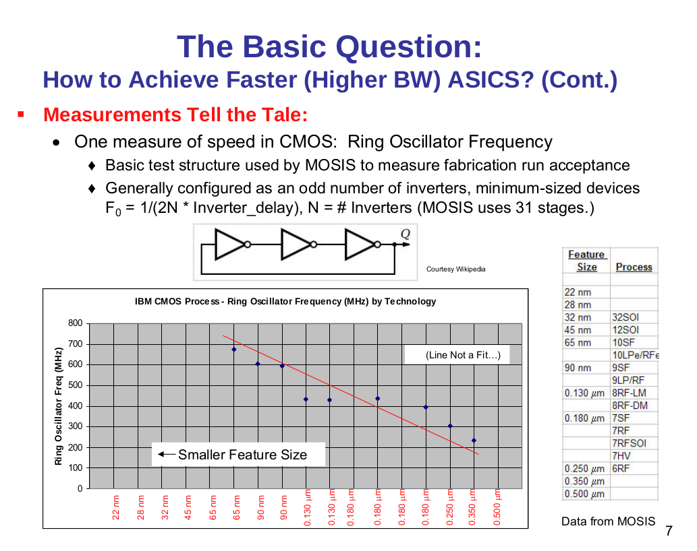
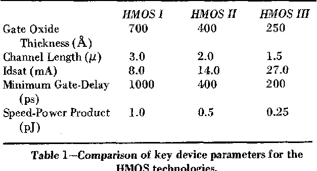

Virtual process technology for Espresso
=======================================

Of course, Espresso is *actually* implemented in an FPGA. However, it is important to assess what would have been possible in its intended time-frame, the early '80s.

What technology node would it have used? Processors in the late '70-s used 3um NMOS process. The Intel 80286 used 1.5um in 1982.

As far as processor speeds go, almost all 3um chips used speeds of less than, or around 5MHz. It was the 1.5um crop that managed to get to 8-10MHz clock ranges.

For Espresso, the clock rate is very important, as its integrated memory controller directly ties processor speed to memory speed. To be useful, it must maximize memory bandwidth, which means a minimum of 6MHz clock (150ns access time DRAM) and a maximum of 12MHz (80ns access time DRAM). This in turn means that this chip would not have really been practical before the advent of 1.5um technology.

To assess how well the design is doing, we need a way to back-project performance metrics to that ancient process node. Luckily `Dennard Scaling <https://en.wikipedia.org/wiki/Dennard_scaling>`_ gives us a way. All we need is some modern process. Here we're lucky again: the `Open Road <https://openroad.readthedocs.io/en/latest/>`_ initiative gives us the tools and even a PDK for 130nm.

To double-check our assumptions, the article: '`Dependence on Feature Size <https://psec.uchicago.edu/workshops/fast_timing_conf_2011/system/docs/25/original/110429_psec_workshop_drake_size_dependence.pdf>`_' provides a comparison of ring oscillators in various old process nodes.

  Technology node vs. ring oscillator speed

It doesn't quite go back in time enough, but `another study <https://www.semanticscholar.org/paper/HMOS-III-technology-Liu-Fu/898e1109886793a09fcdef2c4133be6acb902e67>`_ shows speeds for HMOS 1/2/3:

  Basic HMOS node comparison

A 130nm process should have an inverter delay of about 35ps. Roughly the same for the other (180nm) node that's available through OpenSilicon.

HMOS 1 is a 3um process and the minimum gate-delay (I'm going to say that's an inverter) is 1ns.

The tech node ratio is 23:1. The speed ratio is 28:1. That's a pretty good fit. In other words, Dennard scaling is applicable.

Synthesis results
-----------------

Using the OpenRoad toolchain and sky130hd PDK, the core area is 0.176mm^2, 0.148mm^2 if I remove the multiplier and the barrel shifter. These numbers don't include IO cells and bond pads, but looking at the size of `those structures <https://gf180mcu-pdk.readthedocs.io/en/latest/IPs/IO/gf180mcu_fd_io/features.html#cell-dimensions>`_, it's clear they're not a significant contributors to area.

From this, I can back-project to various earlier nodes, using Dennard scaling:

========  ============== ============= ==========================================================================================
 Node     Core die area   Fmax          Comparison `* <https://en.wikipedia.org/wiki/Transistor_count#Transistor_density>`_
========  ============== ============= ==========================================================================================
 130nm    0.176mm^2       100MHz
 1.5um    23mm^2          8.6MHz       49mm^2 for 80286
 2um      41mm^2          6.5MHz
 3um      93mm^2          4.3MHz       60mm^2 for 80186; 33mm^2 for 8088; 64mm^2 for MC68000
========  ============== ============= ==========================================================================================

According to `a rockwell paper <http://www.bitsavers.org/components/rockwell/Trends_in_Microcomputer_Technology_1977.pdf>`_ people estimated 40,000mil^2 (62mm^2) dies to be economical in the early '80s. Espresso would be rather cheap, if manufactured in 1.5 or 2u process nodes. 3u is not really feasible not just for die-size, but for speed reasons as well.

Timing-wise, the design seems to be closing at 100MHz (though I'm not quite sure about my constraints) at 130nm. If that's true, we are on target to hit about 8MHz in 1.5u.

IO cells are apparently missing from the sky130 PDK. The gf180 PDF has them. Here's some data:

RAMs
~~~~

The above synthesis put everything (FIFOs, register files) in registers. Theoretically some area gains could be had by generating memories and using those instead. There is also the question if some sort of cache would be a possibility in 1.5u.

I have found a `RAM example <https://github.com/ShonTaware/SRAM_SKY130#openram-configuration-for-skywater-sky130-pdks>`_ for the sky130 SDK: it's a 32x1024bit RAM (single-ported, 6T cells).

It's size is 0.534mm^2, it closes timing at about 80MHz.

Back-scaling it to 1.5u, gives us 71mm^2 for this 32kbit SRAM or 0.00217mm^2/bit.

The benefit of converting the register file and the instruction queue to memories is still hard to quantify, unfortunately: memory cell overhead grows with decrease of memory size. The register file would be only 14 words of 32 bits, triple-ported on top of that. I don't think I can reasonable extrapolate from this one example, not to mention that I would need to somehow estimate the area taken up by the registers as used in the current design as well. Pretty much the only thing that can be said is that there is some slack in the design, making the area predictions a little pessimistic.

What if we wanted to add a 1kByte ICache to the system though? For that exercise, the above metrics are a reasonable starting point. Just the SRAM array would have taken up 17.78mm^2. With the controller logic, we could easily have doubled our die-area. So, no ICache for sure!
