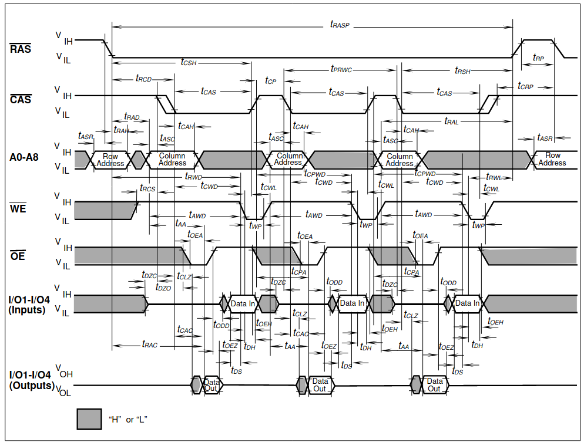

Appendix A: DRAM History
========================

Various DRAM capacities were introduced in the following years `* <http://doctord.dyndns.org/Courses/UNH/CS216/Ram-Timeline.pdf>`_ :

======    ========
Year      Capacity
======    ========
1970      1kbit
1973      4kbit
1976      16kbit
1978      64kbit
1982      256kbit
1986      1Mbit
1988      4Mbit
1991      16Mbit
1994      64Mbit
1998      256Mbit
======    ========

Since Espresso is an early '80-s CPU, we plan on 64kBit and 256kBit devices. With two banks and 16-bits of memory in each, we can scale up to 1MByte of DRAM. That would probably have been very expensive though. A low-end configuration would probably have had no more than 128kByte of RAM. (For comparison, the first PC models supported 64 or 128kByte of RAM and the first Macintosh models in '84 also came with a meager 128k of memory.)

DRAM Datasheets
~~~~~~~~~~~~~~~

Some DRAM datasheets:

- `16kx1 <https://www.jameco.com/Jameco/Products/ProdDS/2288023.pdf>`_
- `64kx1 <https://www.jameco.com/Jameco/Products/ProdDS/2290535SAM.pdf>`_
- `64kx4 <https://downloads.reactivemicro.com/Electronics/DRAM/NEC%20D41464%2064k%20x%204bit%20DRAM%20Data%20Sheet.pdf>`_
- `256kx1 <https://pdf1.alldatasheet.com/datasheet-pdf/view/37259/SAMSUNG/KM41256A.html>`_
- `256kx4 <https://pdf1.alldatasheet.com/datasheet-pdf/view/45238/SIEMENS/HYB514256B.html>`_
- `1Mx1 <https://datasheetspdf.com/pdf-file/550187/MicronTechnology/MT4C1024/1>`_
- `1Mx16 <https://www.mouser.com/datasheet/2/198/41lv16105b-1169632.pdf>`_
- `4Mx4 <https://www.digikey.com/htmldatasheets/production/1700164/0/0/1/MSM51V17400F.pdf>`_
- `16Mx1 <https://www.digchip.com/datasheets/parts/datasheet/409/KM41C16000CK-pdf.php>`_

There were two memory module formats: 30 pin and 72 pin.

- `<https://en.wikipedia.org/wiki/SIMM>`_
- `<https://www.pjrc.com/tech/mp3/simm/datasheet.html>`_
- `Current source for both kinds of sockets <https://www.peconnectors.com/sockets-pga-cpu-and-memory/hws8182/>`_

EDO datasheets:

- `4/8MB module <https://www.digchip.com/datasheets/download_datasheet.php?id=687767&part-number=MT2D132>`_
- `JEDEC standard extract <https://www.ele.uri.edu/iced/protosys/hardware/datasheets/simm/Jedec-Clearpoint-8MB.pdf>`_
- `16/32MB module <https://www.digchip.com/datasheets/download_datasheet.php?id=987285&part-number=TM893GBK32S>`_
- `Another 16/32MB Module <https://docs.rs-online.com/1faa/0900766b80027c7f.pdf>`_

DRAM speeds
~~~~~~~~~~~

There are four important timing parameters for DRAM timing:

256kbit devices (and more modern 64-kbit variants as well) came in the following speed-grades:

=========== ===== ===== ===== ===== ===== =====
Part number       uPD41464         KM41256
----------- ----------------- -----------------
Speed grade  -80   -10   -12   -10   -12   -15
=========== ===== ===== ===== ===== ===== =====
t_rcd        40ns  50ns  60ns  50ns  60ns  75ns
t_cas        40ns  50ns  60ns  50ns  60ns  75ns
t_cp         30ns  40ns  50ns  45ns  50ns  60ns
t_rp         70ns  90ns  90ns  90ns 100ns 100ns
=========== ===== ===== ===== ===== ===== =====

Very early devices also had a -20 (200ns) speed-grade to them, but that's too slow for Espresso.

Fast-page-mode devices, such as the one used in late-issue Amiga A500 boards have significantly improved timing:

=========== ===== ===== ===== ===== ===== =====
Part number     HYB514256B         MT4C1024
----------- ----------------- -----------------
Speed grade  -50   -60   -70   -6    -7    -8
=========== ===== ===== ===== ===== ===== =====
t_rcd        35ns  45ns  50ns  40ns  50ns  60ns
t_cas        15ns  15ns  20ns  20ns  20ns  20ns
t_cp         10ns  10ns  10ns  10ns  10ns  10ns
t_rp         35ns  40ns  50ns  40ns  50ns  60ns
=========== ===== ===== ===== ===== ===== =====

=========== ====== ====== ====== ======
Part number  KM41C16000C  IS41LV16105B
----------- ------------- -------------
Speed grade   -5     -6     -50    -60
=========== ====== ====== ====== ======
t_rcd        37ns   45ns   37ns   45ns
t_cas        13ns   15ns    8ns   10ns
t_cp         10ns   10ns    9ns    9ns
t_rp         35ns   40ns   30ns   40ns
=========== ====== ====== ====== ======

EDO, when introduced in '95 was even faster. For Espresso, we are focusing on page-mode devices and their timing characteristics. Newer devices will work with those timings as well, but you can't take advantage of their new, improved timing.
